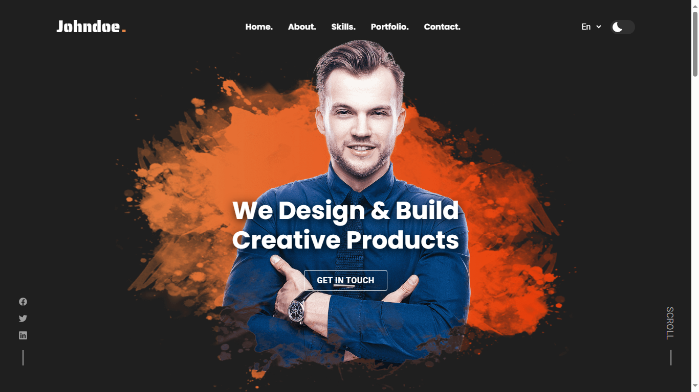

# 🌟 John Doe Portfolio Website Template 🌟

A simple, clean, and responsive personal portfolio website template, perfect for showcasing your projects and skills. This repository contains all the necessary code to create a personal website like John Doe's.

## ✨ Features

- **Responsive Design:** 📱💻 Works on all devices (desktops, tablets, and smartphones).
- **Clean Code:** 🧼 Well-commented and structured HTML, CSS, and JavaScript.
- **Customizable:** 🛠️ Easy to personalize with your own information, projects, and images.
- **Modern Layout:** 🎨 A sleek and professional design to impress potential employers or clients.

## 🚀 Demo

You can view a live demo of the template [here](https://johndoe-portfolio-website-main.vercel.app/).

## 📚 Usage

Replace the placeholder content with your own:

- **index.html:** Update the HTML content with your own name, about section, projects, etc.
- **style.css:** Modify the CSS to match your personal style or color scheme.
- **script.js:** Add any custom JavaScript functionality if needed.
- **images:** Replace the placeholder images in the `images` folder with your own.

## 🤝 Contributing

Contributions are what make the open-source community such an amazing place to learn, inspire, and create. Any contributions you make are **greatly appreciated**.

1. Fork the Project 🍴
2. Create your Feature Branch (`git checkout -b feature/AmazingFeature`) 🌟
3. Commit your Changes (`git commit -m 'Add some AmazingFeature'`) 💬
4. Push to the Branch (`git push origin feature/AmazingFeature`) 🚀
5. Open a Pull Request 📬

## 📄 License

Distributed under the MIT License. See `LICENSE` for more information.
